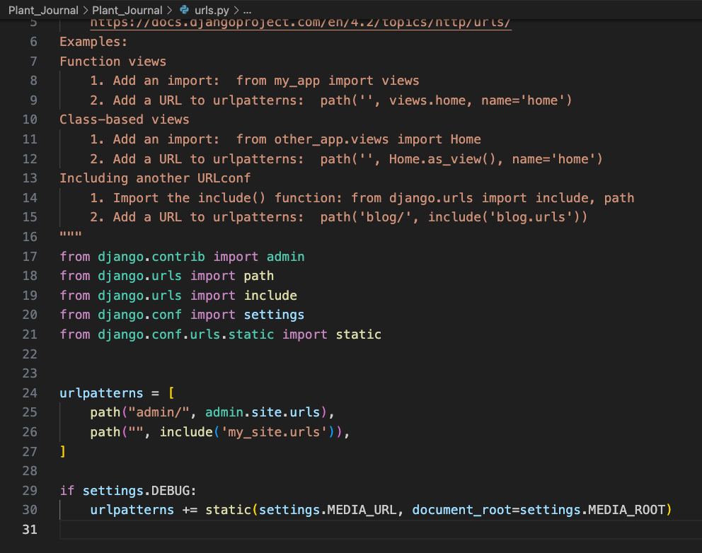
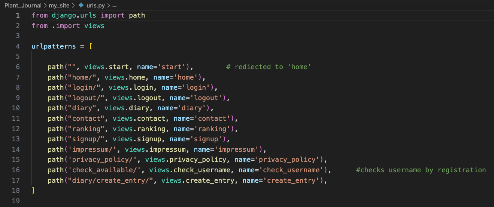
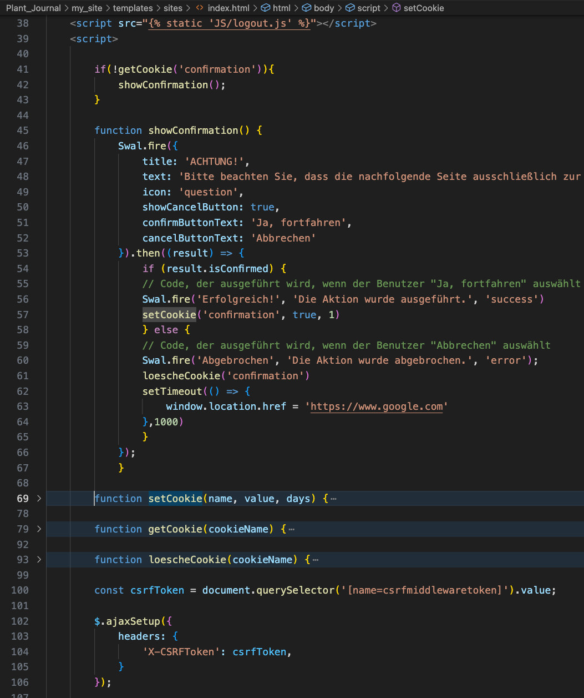
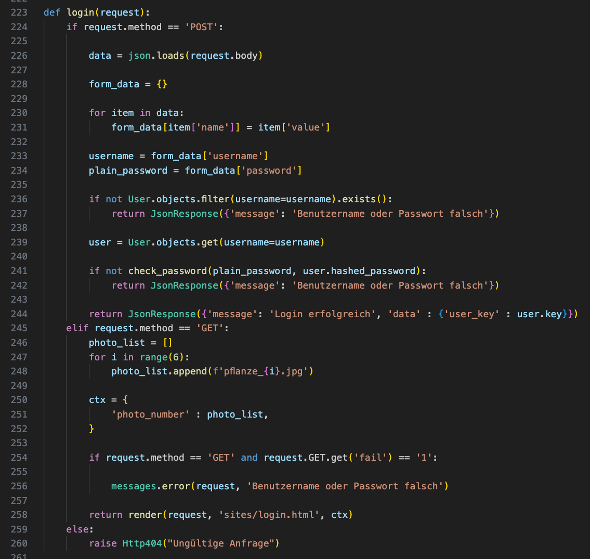
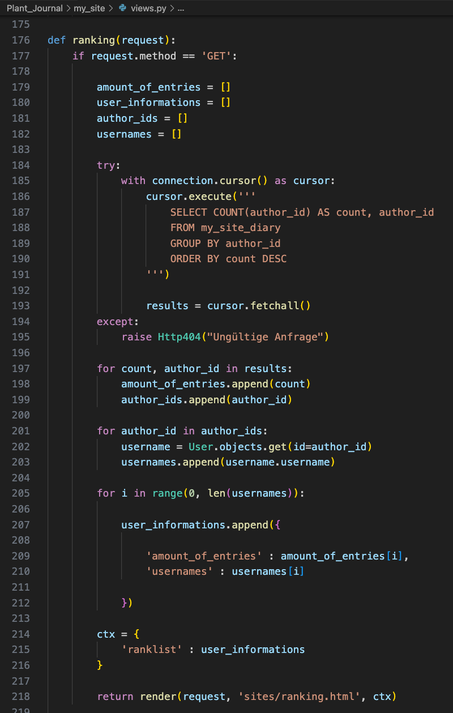
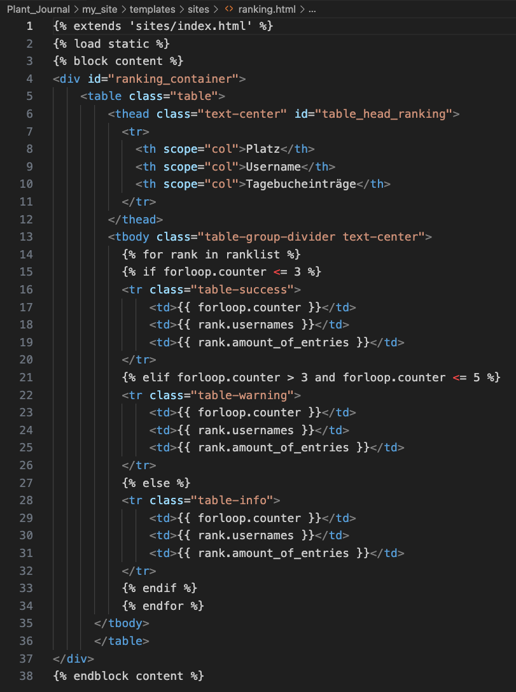
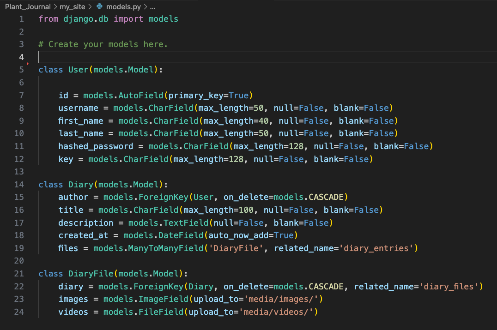

# DP-Coding-Plant-Journal

Introducing our innovative website dedicated to plant enthusiasts worldwide. With our platform, you can create and maintain a digital diary to track the growth and development of your plants. Each user gets a personalized login, ensuring the privacy of their data. What sets us apart is the global community aspect - you can connect with plant lovers from around the world and compare your plant diaries. Discover whose diary showcases the most impressive and flourishing collection of plants. Join us today and be part of a thriving global network of passionate plant enthusiasts!

## Installation

--> Clone or copy this repository then:

```bash
  cd Plant_Journal
  pipenv install 
```

--> Activate the new virtual environment.

```bash
  cd Plant_Journal
  pipenv run pyhton manage.py makemigrations
  pipenv run pyhton manage.py migrate
  pipenv run pyhton manage.py runserver
```

--> If you want to access the database from the Django backend, under /admin:

```bash
  pipenv run python manage.py createsuperuser
```

--> Now, you can log in with your admin credentials and inspect the database from the Django backend

## Environment Variables

To run this project, you will need to add the following environment variables to your .env file

`SECRET-KEY`
`DB_Name`
`DB_USER`
`DB_PASSWORD`
`DB_HOST`
`DB_PORT`
`SESSION_COOKIE_AGE`


## Feedback

If you have any feedback, please reach out to us at dp_coding@icloud.com


## License

[MIT](https://choosealicense.com/licenses/mit/)

[BSD 3-Clause](https://github.com/django/django/blob/main/LICENSE)

[Jquery additionals](https://jquery.org/license/)
## Optimizations

When this application becomes larger and more intricate, it is advisable to embark on some optimization efforts concerning both authentication and query operations. As complexity grows, it becomes increasingly prudent to fine-tune authentication processes and enhance query efficiency.

## Screenshots





The showConfirmation function serves to inquire whether the visitor is comfortable with the fact that all entered data will not be deleted. Simultaneously, it is emphasized that this web application is solely for illustrative purposes and is not an officially accessible website.



Here is the login view. Data validation takes place in the frontend, which can expedite the validation process instead of initially verifying it in the backend and then processing the response in the frontend. However, it is advisable to consider making changes if this application becomes larger and/or more complex, in order to enhance backend security against potential threats.



In the ranking view, a raw SQL query was employed to directly process data from the query. As the application scales or becomes more intricate, or if sensitive data is to be stored in the database, it is advisable to consider modifying the query.




In the models, a choice was made to store media files directly on the server. However, as the application grows or accumulates a larger user base, it is advisable to consider transitioning to a cloud service such as AWS, as performance may otherwise be adversely affected.

## Security

In this web application, we have largely refrained from relying on the Django authentication module. Instead, we have established our own user model and custom forms. Authentication takes place through a 'user_key' generated using the Python module 'secret'. If there is a need to store additional or sensitive data beyond 'Diary' and 'Media' information, it is advisable to consider altering the entire authorization and authentication process.